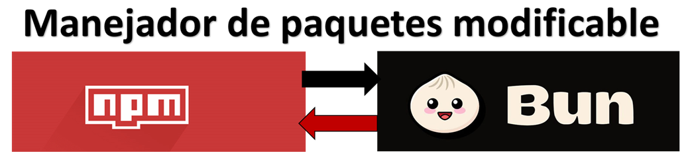
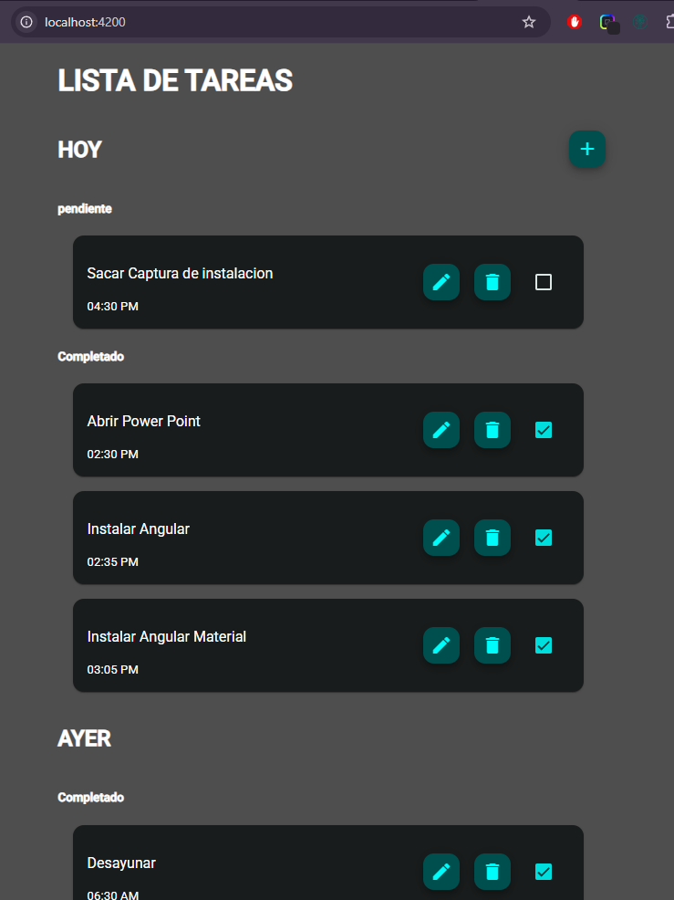
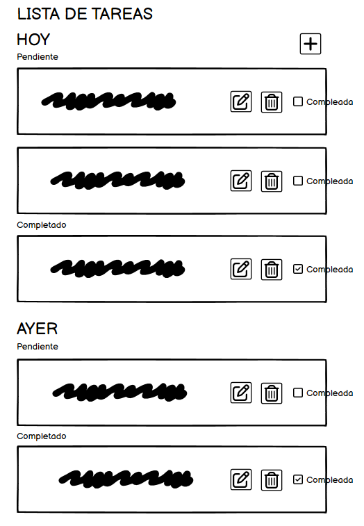
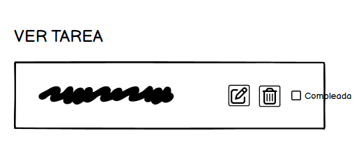
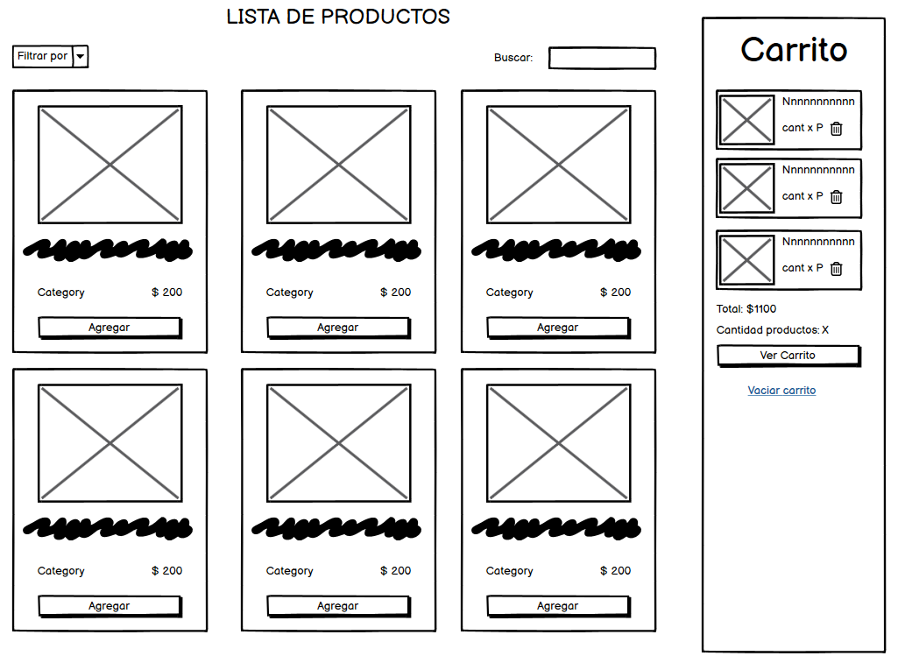
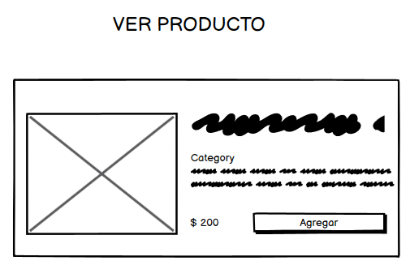
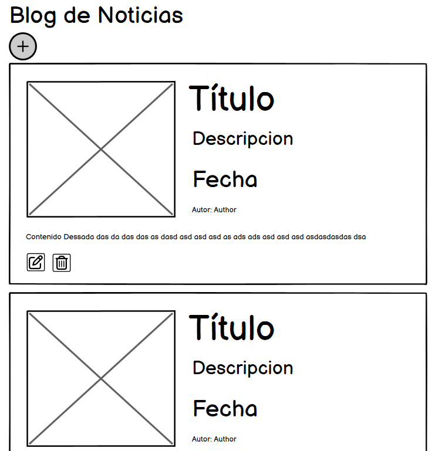
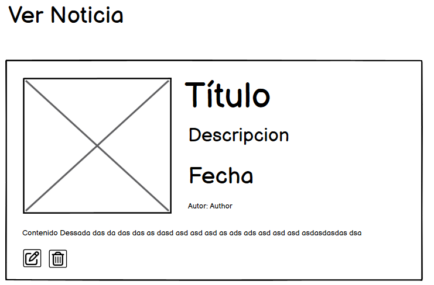

# PROYECTOS

Labrotario de practicas full stack - dev frontend\
Para probar cada proyecto se debe clonar el repositorio actual con
```bash
git clone https://github.com/RomanSystems/practicas-ng-dev.git
```

Una vez clonado, debemos ir al proyecto
```bash
cd to-do-list
```

Actualizar los repositorios anclados
```shell
git submodule update --init --recursive
```


# Cambio de manejador de paquetes de npm a bun


Instalar bun (si fuese necesario ir a su página oficial)
```shell 
# En MacOs / Linux
curl -fsSL https://bun.sh/install | bash
```

```shell 
# En windows
powershell -c "irm bun.sh/install.ps1|iex"
```

# Instalar el node_modules
```shell
bun install
```

# Iniciar proyecto
```shell
bun start
```

Resultado

TODO LIST\


CATALOG PRODUCT\


MY BLOG\


# MAQUETACION con Balsamiq
# ToDo
Lista tareas\


Ver tarea\


# Catalog products
Lista\


Ver\


# My blog
Lista\


Ver\


# ARQUITECTURA LIMPIA
```
src/
├── app/
│   ├── core/                                      # Dominio puro (sin Angular)
│   │   ├── models/
│   │   │   └── product.model.ts                   # Interfaz de producto
│   │   ├── services/
│   │   │   └── cart-repository.interface.ts       # Abstracción del repositorio
│   │   └── use-cases/
│   │       ├── add-product.usecase.ts             # Caso de uso
│   │       ├── sales/
│   │       │   ├── create-sales-order.usecase.ts
│   │       │   ├── approve-sales-order.usecase.ts
│   │       │   └── generate-sales-report.usecase.ts
│   │       ├── billing/
│   │       │   ├── generate-invoice.usecase.ts
│   │       │   ├── void-invoice.usecase.ts
│   │       │   └── issue-credit-note.usecase.ts
│   │       └── payments/
│   │           ├── register-payment.usecase.ts
│   │           ├── refund-payment.usecase.ts
│   │           └── generate-cashflow-report.usecase.ts
│   ├── data/                                      # Implementaciones concretas
│   │   └── repositories/
│   │       └── local-cart.repository.ts           # Implementación usando localStorage
│   ├── presentation/                              # Todo lo visible y que usa Angular
│   │   ├── components/
│   │   │   └── cart/
│   │   │       ├── cart.component.ts
│   │   │       └── cart.component.html
│   │   ├── pages/
│   │   │   └── home/
│   │   │       └── home.component.ts
│   │   └── state/
│   │       └── cart.store.ts
│   │       ---sino----
│   │       ├── cart.actions.ts
│   │       ├── cart.reducer.ts
│   │       ├── cart.selectors.ts
│   │       └── cart.effects.ts
│   │
│   ├── injection-tokens.ts                         # Tokens de DI para repositorios
│   ├── app.component.ts
│   └── app.module.ts
│
└── main.ts
```