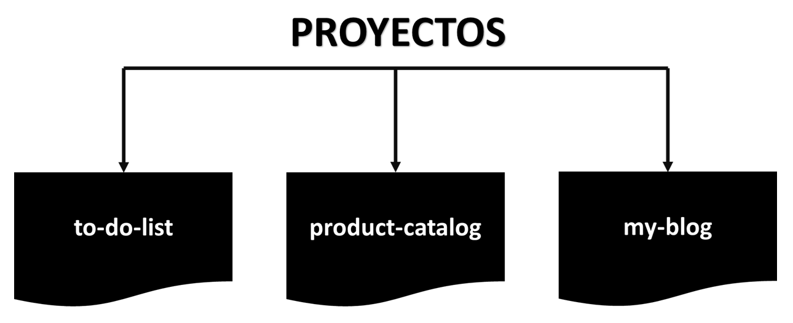
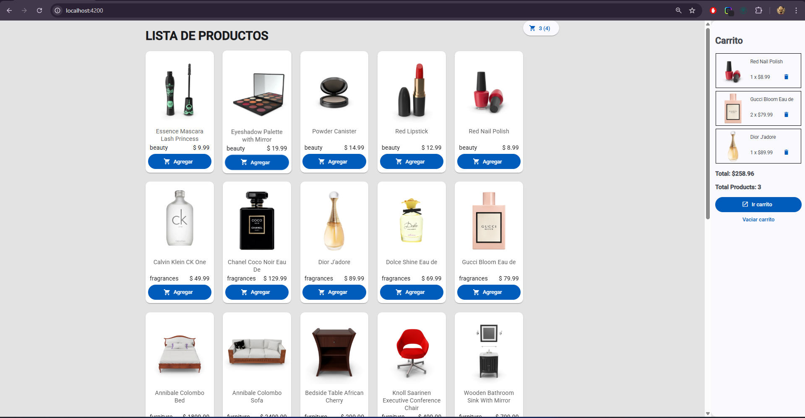

# PROYECTOS

Labrotario de practicas full stack - dev frontend\
Para probar cada proyecto se debe clonar el repositorio actual con
```bash
git clone https://github.com/RomanSystems/practicas-ng-dev.git
```

Una vez clonado, debemos ir al proyecto
```bash
cd to-do-list
```

Actualizar los repositorios anclados
```shell
git submodule update --init --recursive
```



# Cambio de manejador de paquetes de npm a bun


Instalar bun (si fuese necesario ir a su página oficial)
```shell 
# En MacOs / Linux
curl -fsSL https://bun.sh/install | bash
```

```shell 
# En windows
powershell -c "irm bun.sh/install.ps1|iex"
```

# Instalar el node_modules
```shell
bun install
```

# Iniciar proyecto
```shell
bun start
```

Resultado

TODO LIST


CATALOG PRODUCT


MY BLOG
